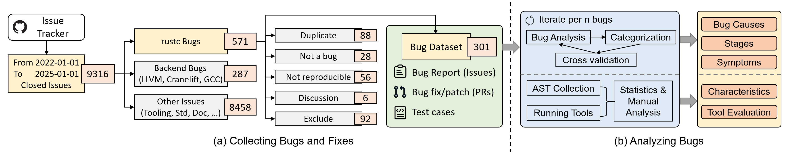

# Artifact: An Empirical Study of Rust-Specific Bugs in the rustc Compiler

This is the artifact for the OOPSLA'25 paper titled "An Empirical Study of Rust-Specific Bugs in the rustc Compiler".

## 1. Introduction

This work conducts a comprehensive and systematic study of Rust-specific bugs in rustc, with a particular focus on the components that support its unique language features. Our analysis examines issues and fixes reported between 2022 and 2024, with a manual review of 301 valid issues. We categorize these bugs based on their causes, symptoms, affected compilation stages, and test case characteristics. Additionally, we evaluate existing rustc testing tools to assess their effectiveness and limitations.

Our bug collection and analysis approach is summarized in the following figure.
First, we perform bug data collection by collecting all closed issues from the official Rust GitHub repository within a specified time frame (2022-01-01 to 2025-01-01). We apply an initial filter using official issue labels, focusing on those related to Rust-specific language mechanisms. 
Then, we manually filter irrelevant or ineligible issues, such as duplicates or those without test cases.
For each remaining issue, we identify the corresponding pull request (PR) and extract the test case provided in the issue description.
The final result is a curated dataset of rustc bugs, each comprising an issue, a PR, and a test case.




## 2. Hardware Dependencies
The artifact can be evaluated on a standard Linux-based system. It does not require any specialized hardware such as GPUs or high-core-count processors. The minimum recommended system requirements are:

- Operating System: Linux (any recent distribution)
- Memory: 8 GB RAM
- Storage: 2 GB of free disk space

No access to special-purpose hardware is necessary. The artifact is designed to run efficiently on a typical desktop or laptop environment used for software development.

## 3. Getting Started Guide

There are two ways to run this project: using Docker or running it directly on a local machine.

### Option 1: Using Docker (Recommended)

A pre-configured Docker environment can simplify setup and ensure compatibility across systems. You can use the provided `Dockerfile` to build the environment with all necessary dependencies.

To build the Docker image named `rustc-bug-study` from source, run the following command (estimated running time: ~5 min)
```bash
docker build -t rustc-bug-study .
```

Run the following command to create a new container.
```bash
docker run -it --rm \
  -v $(pwd)/data_collection:/app/data_collection \
  -v $(pwd)/plot:/app/plot \
  -v $(pwd)/scripts:/app/scripts \
  -v $(pwd)/Test_Case_Characteristics:/app/Test_Case_Characteristics \
  -v $(pwd)/test_cases:/app/test_cases \
  -v $(pwd)/data:/app/data \
  -w /app \
  rustc-bug-study
```


### Option 2: Run Locally

To run the project locally, your system should meet the following requirements:

* **Operating System**: A Unix-like operating system
  *(tested on Ubuntu)*
* **Rust**: Installed and properly configured
  *(tested on Rust 1.87)*
* **Python**: Version 3.12 or higher
  *(tested on Python 3.12)*

Make sure `cargo` and `python3` are available in your environment. You may also need to install Python packages listed in `requirements.txt` by running:

```bash
pip install -r requirements.txt
```


### Project Structure

* **`data_collection` folder**: A Python project for automatically crawling GitHub issues.
* **`plot` folder**: Contains all scripts for data visualization.
* **`scripts` folder**: Contains all scripts used to reproduce the results in our study.
* **`Test_Case_Characteristics` folder**: A Rust project for extracting ASTs and collecting node-level statistics to analyze test case features.
* **`test_cases` folder**: Stores all collected bug-revealing test cases.

* **`Data Files` folder**:
  
  * **`all_issues.csv`**: Contains all collected and labeled GitHub issues.  
  * **`item_node_counts.csv`**: Contains statistics of `Item` nodes in ASTs. This file can be generated by running the `Test_Case_Characteristics` project.  
  * **`type_node_counts.csv`**: Contains statistics of `Type` nodes in ASTs. This file can also be generated by running the `Test_Case_Characteristics` project.

### Figures

* **`Fig4a.pdf`**, **`Fig4b.pdf`**, **`Fig10a.pdf`**, and **`Fig10b.pdf`**: These are the visualizations corresponding to Figures 4(a), 4(b), 10(a), and 10(b) in our paper. They can be plotted using the scripts in the `plot` folder.


## 4. Step by Step Instructions


In the following section, we provide instructions for reproducing the results presented in the paper.

### Collecting Bugs & Fixes (Section 2)

To reproduce Table 1, please run the following script to print statistics of our collect labels.
```bash
python3 ./scripts/labels.py
```

The above script prints the following:
```
Label                         Count
========================================
A-HIR                         20
A-THIR                        1
----------------------------------------
A-MIR                         43
A-mir-opt                     78
A-mir-opt-inlining            23
A-mir-opt-GVN                 0
A-mir-opt-nrvo                0
A-stable-MIR                  1
----------------------------------------
A-type-system                 25
A-inference                   29
A-closures                    29
A-coercions                   13
A-const-generics              70
A-DSTs                        0
A-zst                         0
A-trait-system                77
A-impl-trait                  68
A-trait-objects               27
A-auto-traits                 14
A-implied-bounds              9
A-coinduction                 0
A-coherence                   14
----------------------------------------
A-lifetimes                   70
A-borrow-checker              45

Backend (Excluded)
========================================
A-LLVM                        275
A-gcc                         2
A-cranelift                   10
```

To reproduce Table 2, please run the following script to print statistics related to our bug collection phases.

```bash
python3 ./scripts/status.py
```

The above script prints the following:
```
Status                 Count
------------------------------
Duplicate                 88
Not a bug                 28
Not reproducible          56
Discussion                 6
Exclude                   92
Valid                    301
------------------------------
Total                    571
```

#### Optional Step: Crawling GitHub Issues

**Running the crawler is not required for the subsequent steps.** Crawling can be time-consuming, and the collected data only contains raw GitHub issue information, without our annotations for bug causes, symptoms, etc.

To ensure consistency, we have already provided the annotated CSV files in this artifact. You can directly proceed to the reproduction steps using the provided `./data/all_issues.csv` file.

If you still want to crawl the issues yourself, please run the following scripts.

**Note**: Please replace `<token>` with your [GitHub authentication token](https://docs.github.com/en/authentication/keeping-your-account-and-data-secure/managing-your-personal-access-tokens).
```bash
cd data_collection
python3 main.py issue ./all_issues.csv <token>
```

The generated `all_issues.csv` file would be stored in `./rustc-bug-study-artifact/data_collection/all_issues.csv`.

### RQ1: Bug Causes (Section 3)

In the first research question, we compute the distribution of bug causes. Specifically, the script reproduces Table 3.
```bash
python3 ./scripts/rq1_causes.py
```

The above script prints the following:
```
Bug Cause                        Count     Ratio
--------------------------------------------------
Trait & Bound                       37     12.3%
Opaque types                        38     12.6%
New solver                           7      2.3%
Well-formedness                      9      3.0%
Subtotal                            91     30.2%
--------------------------------------------------
Borrow & Move                        7      2.3%
Lifetime                            34     11.3%
Subtotal                            41     13.6%
--------------------------------------------------
Wrong implementations               34     11.3%
Missing cases                       12      4.0%
Subtotal                            46     15.3%
--------------------------------------------------
Basic structure                     38     12.6%
Error handling & Reporting          75     24.9%
Compatibility                       10      3.3%
Subtotal                           123     40.9%
--------------------------------------------------
Total                              301    100.0%
```

As for the bug prone compilation stages, please run the following script to reproduce Fig. 4 (a):

```bash
python3 ./scripts/rq1_components_a.py
```

The above script prints the following:
```
Stage                                Cause       Ratio
--------------------------------------------------------
1. AST                  Type System Errors        0.3%
1. AST         Ownership & Lifetime Errors        3.7%
1. AST             MIR Optimization Errors        0.0%
1. AST                      General Errors        4.0%
Subtotal                                24        8.0%
--------------------------------------------------------
2. HIR                  Type System Errors       20.3%
2. HIR         Ownership & Lifetime Errors        5.0%
2. HIR             MIR Optimization Errors        0.0%
2. HIR                      General Errors       19.6%
Subtotal                               135       44.9%
--------------------------------------------------------
3. MIR                  Type System Errors        6.3%
3. MIR         Ownership & Lifetime Errors        5.0%
3. MIR             MIR Optimization Errors       15.3%
3. MIR                      General Errors        8.6%
Subtotal                               106       35.2%
--------------------------------------------------------
4. Code Gen             Type System Errors        0.0%
4. Code Gen    Ownership & Lifetime Errors        0.0%
4. Code Gen        MIR Optimization Errors        0.0%
4. Code Gen                 General Errors        1.7%
Subtotal                                 5        1.7%
--------------------------------------------------------
5. Utility              Type System Errors        3.3%
5. Utility     Ownership & Lifetime Errors        0.0%
5. Utility         MIR Optimization Errors        0.0%
5. Utility                  General Errors        4.7%
Subtotal                                24        8.0%
--------------------------------------------------------
6. LLVM                 Type System Errors        0.0%
6. LLVM        Ownership & Lifetime Errors        0.0%
6. LLVM            MIR Optimization Errors        0.0%
6. LLVM                     General Errors        2.3%
Subtotal                                 7        2.3%
--------------------------------------------------------
Total                                  301      100.0%
```

similarly, please run the following script to reproduce Fig. 4 (b):
```bash
python3 ./scripts/rq1_components_b.py
```

The above script prints the following:
```
Stage                                Cause       Ratio
--------------------------------------------------------
1. AST                  Type System Errors        0.3%
1. AST         Ownership & Lifetime Errors        3.7%
1. AST             MIR Optimization Errors        0.0%
1. AST                      General Errors        4.0%
Subtotal                                24        8.0%
--------------------------------------------------------
2. HIR                  Type System Errors       20.3%
2. HIR         Ownership & Lifetime Errors        5.0%
2. HIR             MIR Optimization Errors        0.0%
2. HIR                      General Errors       19.6%
Subtotal                               135       44.9%
--------------------------------------------------------
3. MIR                  Type System Errors        6.3%
3. MIR         Ownership & Lifetime Errors        5.0%
3. MIR             MIR Optimization Errors       15.3%
3. MIR                      General Errors        8.6%
Subtotal                               106       35.2%
--------------------------------------------------------
4. Code Gen             Type System Errors        0.0%
4. Code Gen    Ownership & Lifetime Errors        0.0%
4. Code Gen        MIR Optimization Errors        0.0%
4. Code Gen                 General Errors        1.7%
Subtotal                                 5        1.7%
--------------------------------------------------------
5. Utility              Type System Errors        3.3%
5. Utility     Ownership & Lifetime Errors        0.0%
5. Utility         MIR Optimization Errors        0.0%
5. Utility                  General Errors        4.7%
Subtotal                                24        8.0%
--------------------------------------------------------
6. LLVM                 Type System Errors        0.0%
6. LLVM        Ownership & Lifetime Errors        0.0%
6. LLVM            MIR Optimization Errors        0.0%
6. LLVM                     General Errors        2.3%
Subtotal                                 7        2.3%
--------------------------------------------------------
Total                                  301      100.0%
```

#### Data Visualization (Optional)
Optionally, the following script can plot Fig. 4 (a) and Fig. 4 (b) and save them as `./plot/Fig4a.pdf` and `./plot/Fig4b.pdf`.
```bash
python3 ./plot/fig4a.py
python3 ./plot/fig4b.py
```
If you are using the Docker container, the files `Fig4a.pdf` and `Fig4b.pdf` will be generated inside the container and can be directly accessed from your host machine in the `./rustc-bug-study-artifact/plot/` directory.

**NOTE:** When generating plots, you might see warnings like the following:
`findfont: Generic family 'sans-serif' not found because none of the following families were found: Arial, DejaVu Sans, Liberation Sans, Bitstream Vera Sans, sans-serif`. This warning is harmless and does not affect the correctness or display of the resulting PDF plots. This message can be ignored.


### RQ2: Bug Symptoms (Section 4)
In the second research question, we compute the distribution of bug symptoms. Specifically, the following two script reproduces Table 4.

```bash
python3 ./scripts/rq2_a.py
```
This script reproduces Table 4 by presenting the detailed breakdown of bug symptoms. It categorizes and counts each sub-type of symptom observed in the dataset.
It prints the following:

```
Symptom                                                   Count       Ratio
-----------------------------------------------------------------------------
1. Crash-Front-end Panic(valid)                              42       14.0%
1. Crash-Front-end Panic(invalid)                            75       24.9%
1. Crash-Back-end Crash                                       3        1.0%
Subtotal                                                    120       39.9%
-----------------------------------------------------------------------------
2. Correctness Issues-Completeness Issues                    56       18.6%
2. Correctness Issues-Soundness Issues                       22        7.3%
Subtotal                                                     78       25.9%
-----------------------------------------------------------------------------
3. Miscompilation-Inconsistent Output Issues                 18        6.0%
3. Miscompilation-Safe Rust Causes UB                        12        4.0%
Subtotal                                                     30       10.0%
-----------------------------------------------------------------------------
4. Diagnostic Issues-Incorrect Warning/Error                 20        6.6%
4. Diagnostic Issues-Improper Fix Suggestion                 38       12.6%
Subtotal                                                     58       19.3%
-----------------------------------------------------------------------------
5. Misoptimization-incorrect                                  9        3.0%
5. Misoptimization-performance                                6        2.0%
Subtotal                                                     15        5.0%
-----------------------------------------------------------------------------
Total                                                       301      100.0%
```


The following script also reproduces Table 4, but focuses on showing the joint distribution and proportions of bug symptoms and their corresponding causes, providing a cross-tabulation of these two dimensions.

```bash
python3 ./scripts/rq2_b.py
```

It prints the following:
```
Symptom GroupCause                              Count       Ratio
----------------------------------------------------------------
1.        Type System Errors                    30       25.0%
1.        Ownership & Lifetime Errors            3        2.5%
1.        MIR Optimization Errors               19       15.8%
1.        General Errors                        68       56.7%
Subtotal                                       120      100.0%
----------------------------------------------------------------
2.        Type System Errors                    43       55.1%
2.        Ownership & Lifetime Errors           17       21.8%
2.        MIR Optimization Errors                7        9.0%
2.        General Errors                        11       14.1%
Subtotal                                        78      100.0%
----------------------------------------------------------------
3.        Type System Errors                     5       16.7%
3.        Ownership & Lifetime Errors            4       13.3%
3.        MIR Optimization Errors               12       40.0%
3.        General Errors                         9       30.0%
Subtotal                                        30      100.0%
----------------------------------------------------------------
4.        Type System Errors                    12       20.7%
4.        Ownership & Lifetime Errors           16       27.6%
4.        MIR Optimization Errors                1        1.7%
4.        General Errors                        29       50.0%
Subtotal                                        58      100.0%
----------------------------------------------------------------
5.        Type System Errors                     1        6.7%
5.        Ownership & Lifetime Errors            1        6.7%
5.        MIR Optimization Errors                7       46.7%
5.        General Errors                         6       40.0%
Subtotal                                        15      100.0%
----------------------------------------------------------------
```


### RQ3: Test Case Characteristics (Section 5)

In the third research question, we analyz the test case characteristics.

To reproduce Table 5, please run the following script to get the LOC information:

```bash
python3 ./scripts/rq3_loc.py
```

It prints the following:
```
Test case (original)             Value
--------------------------------------
Mean                              17.8
Median                            12.0
Second smallest non-zero             2
Max                                346

Test case (reduced)              Value
--------------------------------------
Mean                              14.2
Median                            11.0
Second smallest non-zero             2
Max                                123
```

To reproduce Table 6, please run the following script to get the information of `Item` node:
```bash
python3 ./scripts/rq3_ast_item.py
```

It prints the following:
```
Node Type            Total   Prevalence    Average        Max
Function               524       100.0%        1.9          8
Struct                 130        37.6%        1.3          4
Impl                   157        37.6%        1.5          6
Trait                  144        34.3%        1.5          6
Use                     64        20.3%        1.2          3
Type                    29         7.4%        1.4          6
Enum                     8         3.0%        1.0          1
Macro                   11         3.0%        1.4          2
ExternCrate              7         2.6%        1.0          1
Static                   7         2.2%        1.2          2
Mod                      8         1.8%        1.6          3
Const                    5         1.8%        1.0          1
Verbatim                 4         1.1%        1.3          2
ForeignMod               2         0.7%        1.0          1
TraitAlias               1         0.4%        1.0          1
Union                    0         0.0%        0.0          0
Other                    0         0.0%        0.0          0
```

To reproduce Table 6, please run the following script to get the information of `Type` node:
```bash
python3 ./scripts/rq3_ast_type.py
```
It prints the following:
```
Node Type            Total   Prevalence    Average        Max
Path                  1262        88.2%        5.3         41
Reference              276        43.9%        2.3         10
Tuple                  161        30.3%        2.0          8
ImplTrait               87        20.7%        1.6         10
Array                   55        11.4%        1.8         10
TraitObject             49        10.7%        1.7          3
Ptr                     35         7.7%        1.7          4
Infer                   18         4.8%        1.4          2
BareFn                  21         4.1%        1.9          5
Slice                   13         3.0%        1.6          3
Never                    1         0.4%        1.0          1
Paren                    1         0.4%        1.0          1
Group                    0         0.0%        0.0          0
Macro                    0         0.0%        0.0          0
Verbatim                 0         0.0%        0.0          0
Other                    0         0.0%        0.0          0
```

To reproduce Table 7, please run the folllowing script to get all the information:
```bash
python3 ./scripts/rq3_features.py
```

It prints the following:
```
Top 5 unstable features:
Feature Line                                       Count Proportion
----------------------------------------------------------------------
#![feature(generic_const_exprs)]                      13      17.8%
#![feature(type_alias_impl_trait)]                    11      15.1%
#![feature(core_intrinsics)]                           9      12.3%
#![feature(custom_mir)]                                8      11.0%
#![feature(async_closure)]                             3       4.1%

Number of valid rows with non-empty 'unstable features' (X): 73
Ratio (X / valid 'Status'): 24.3%
--------------------------------------------------------------------------------
Top 5 flags:
Flag                                     Count Proportion
------------------------------------------------------------
-Zmir-opt-level=X                           26      45.6%
-Zmir-enable-passes=+X                       9      15.8%
+nightly                                     8      14.0%
-Copt-level=X                                8      14.0%
--edition=X                                  7      12.3%

Number of valid rows with non-empty 'command' (X): 57
Ratio (X / valid 'Status'): 18.9%
--------------------------------------------------------------------------------
Top 5 traits:
Trait                          Count Proportion
--------------------------------------------------
Sized                             32      49.2%
FnOnce                             8      12.3%
Iterator                           5       7.7%
Copy                               4       6.2%
FnMut                              3       4.6%

Number of valid rows with non-empty 'trait' (X): 65
Ratio (X / valid 'Status'): 21.6%
--------------------------------------------------------------------------------
Feature     Count  Frequency
------------------------------
Lifetime      104      34.6%
std            56      18.6%
dyn            30      10.0%
async          22       7.3%
core           19       6.3%
--------------------------------------------------------------------------------
```

#### Parsing AST (Optional)
Optionally, if you want to parse the AST and get all the information, please run the Rust project in `Test_Case_Characteristics`. The script is as follows:
```bash
cd Test_Case_Characteristics
cargo run
```
Then, two files (`item_node_counts.csv` and `type_node_counts.csv`) will be saved in `./Test_Case_Characteristics` folder, which is same as `./item_node_counts.csv` and `./type_node_counts.csv`.

If you are using the Docker container, these files can be directly accessed from your host machine in the `./rustc-bug-study-artifact/Test_Case_Characteristics/` directory.

**IMPORTANT NOTE:** During the execution of `cargo run`, you may encounter log messages such as *Failed to parse file*. This behavior is expected. As mentioned in our paper, a small number of files fail during AST parsing. As long as the final outputs `./Test_Case_Characteristics/item_node_counts.csv` and `./Test_Case_Characteristics/type_node_counts.csv` match the corresponding files provided in the artifact directory: `./item_node_counts.csv` and `./type_node_counts.csv`, the process has completed as intended and the results are correct.


### RQ4: Status of Existing Techniques (Section 6)

In the last research question, we analyze the status of existing techniques. 

To reproduce Fig. 10(a), please run the following script to get the distribution of bug symptoms across existing tools:
```bash
python3 ./scripts/rq4_a.py
```
It prints the following:
```
Symptom Group               Found by          Count
---------------------------------------------------
1. Crash                    members              18
                            icemaker             56
                            developer            41
                            Rustlantis            1
                            fuzz-rustc            4
Subtotal                                        120
---------------------------------------------------
2. Correctness Issues       members              40
                            developer            38
Subtotal                                         78
---------------------------------------------------
3. Miscompilation           members               8
                            icemaker              1
                            developer            13
                            Rustlantis            8
Subtotal                                         30
---------------------------------------------------
4. Diagnostic Issues        members              14
                            icemaker              2
                            developer            42
Subtotal                                         58
---------------------------------------------------
5. Misoptimization          members               6
                            developer             9
Subtotal                                         15
---------------------------------------------------
```

To reproduce Fig. 10(b), please run the following script to get the distribution of bug causes across testing tools:
```bash
python3 ./scripts/rq4_b.py
```
It prints the following:
```
Cause Group                     Found by          Count
-------------------------------------------------------
Type System Errors              members              31
                                icemaker             11
                                developer            47
                                fuzz-rustc            2
Subtotal                                             91
-------------------------------------------------------
Ownership & Lifetime Errors     members              19
                                icemaker              1
                                developer            19
                                Rustlantis            1
                                fuzz-rustc            1
Subtotal                                             41
-------------------------------------------------------
MIR Optimization Errors         members              14
                                icemaker              8
                                developer            19
                                Rustlantis            5
Subtotal                                             46
-------------------------------------------------------
General Errors                  members              22
                                icemaker             39
                                developer            58
                                Rustlantis            3
                                fuzz-rustc            1
Subtotal                                            123
-------------------------------------------------------
```

#### Data Visualization (Optional)
Optionally, the following script can plot Fig. 10 (a) and Fig. 10 (b) and save them as `./Fig10a.pdf` and `./Fig10b.pdf`.
```bash
python3 ./plot/fig10a.py
python3 ./plot/fig10b.py
```
If you are using the Docker container, the files `Fig10a.pdf` and `Fig10b.pdf` will be generated inside the container and can be directly accessed from your host machine in the `./rustc-bug-study-artifact/plot/` directory.

**NOTE:** When generating plots, you might see warnings like the following:
`findfont: Generic family 'sans-serif' not found because none of the following families were found: Arial, DejaVu Sans, Liberation Sans, Bitstream Vera Sans, sans-serif`. This warning is harmless and does not affect the correctness or display of the resulting PDF plots. This message can be ignored.


## 5. Reusability Guide

The core components of this artifact that are intended for reuse include:

- **Issue Collection Scripts**: These scripts can be easily adapted to collect GitHub issues over different timeframes or targeting different labels. Users only need to modify a few configuration parameters (e.g., target_labels, start_date, end_date) to collect a customized issue set.

- **Data Analysis and Visualization Scripts**: All data processing and visualization components are reusable, provided that the input CSV files retain the expected column structure. These scripts generate summary statistics and plots that can be applied to other datasets with minimal modification.

- **AST Node Collection Tool**: This tool extracts and summarizes AST node types from Rust programs. It is fully reusable—given any Rust source code as input, the tool can generate the corresponding AST node types and statistics automatically.

### How to Adapt the Artifact
To adapt the artifact to new use cases:

- **Issue Collection**: Edit the configuration file or script arguments to specify new target_labels or a different time range. The rest of the pipeline will function without changes.

- **Data Analysis**: Ensure that input CSV files maintain the necessary columns (as described in the provided script comments). You can then reuse the scripts for aggregation and visualization.

- **AST Node Collection**: Simply replace the input Rust file(s) with your own; the tool will output updated AST node statistics accordingly.